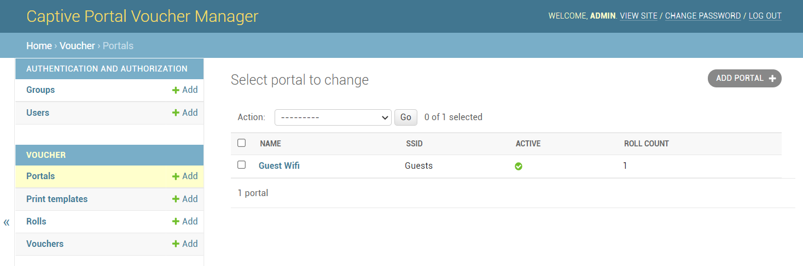
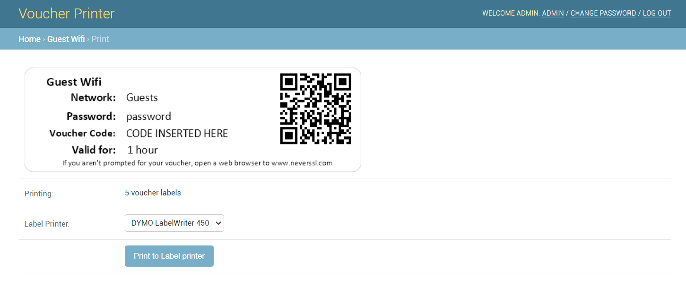
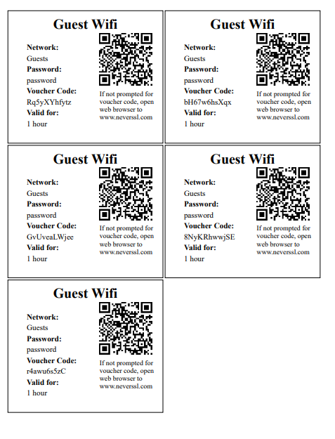
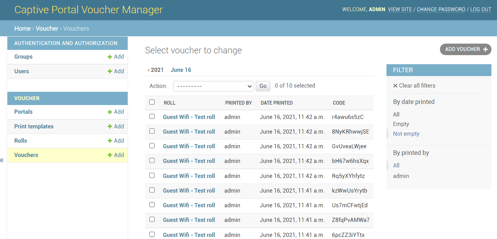

# Voucher Printer

This software create a website where staff can print vouchers for the pfSense captive portal. Or any other captive portal that can export vouchers as a text file with one code per line.

## Features

- Supports multiple captive portals, each with multiple sets of vouchers
- Access control with local or LDAP users
- Assign users to only have access to specific portals
- Import voucher codes from pfSense
- Tracks who printed each voucher and the date it was printed
- Customizable templates for printing on paper or with Dymo Labelwriter label printers

## Screenshots

## Deploying

This software is intended to be deployed via docker.

By default, it will deploy a postgres database and the web component. Several settings need to be changed in the docker-compose.yml file before deploying:

- `ALLOWED_HOSTS` should match the domain name you'll use to access the site.
- `SUPERUSER_USERNAME`, `SUPERUSER_PASSWORD`, and `SUPERUSER_EMAIL` should be set to create an initial account. You can change the password later.
- `TIME_ZONE` should match your local time zone.
- If behind a proxy providing HTTPS (which you should do!), you can set `SECURE_COOKIES` and `SECURE_HSTS_SECONDS` to force HTTPS to be used.
- Change `~/data` in volumes to point to a folder to store persistent files for the container. You may need edit some of the files created there later for some advanced settings.

Once your docker-compose.yml file has the appropriate settings, just run `docker-compose up -d` to launch it.

## Initial Setup

- Login with your SUPERUSER account and click ADMIN at the top to go to the admin site.
- Click Groups and create at least one group to assign to a portal. Then click Users and add yourself to that group. You don't need to add any permissions to the group.
- Add a Portal, and fill in the information. Choose which groups should be allowed to print vouchers for this portal.
- Add a roll of vouchers. Choose the portal they belong to, the roll number, a description and time limit, and upload the CSV file pfSense generated for that roll. All the vouchers will be added automatically. If the voucher code already exists in the system, it will be skipped.
- Click View Site at the top to go back to the main site, and print your vouchers.

### Customizing Templates

Two default templates, one for paper printers and one for Dymo labelwriters, are included. You can create more templates if you don't like the default ones. Each portal can have one or more templates
assigned to it, so different portals can use different templates.

For paper templates, create some HTML code that will be repeated for each voucher. Use the existing template as an example. The fields that will be replaced are listed on the new template page.
You can use inline CSS to format your vouchers however you like.

For Dymo templates, create a label in the Dymo Connect software and save it. Make sure to include fields for:

- PortalName
- SSID
- PSK - the preshared key for the network
- CODE - the actual voucher code
- TimeLimit
- QRCode

Since there doesn't appear to be any way to set the object's name, you'll have to edit the file in a text editor to make some changes to it. Find each section and change the <Name> to the above names.
All of the fields must exist in the label file. If you don't want to use some of them, set them to be very small with white text.

Due to a bug in the SDK, you may also have to find each and every <Color> tag in the file, and add a space between the opening and closing tags.

Once you have your XML file, choose print templates in the admin site, add a new template, and paste your XML into the template field. Make sure not to add any blank lines at the top or bottom.

### CSV Format

The CSV import expects vouchers in the format pfSense exports them - one voucher per line, and no other fields.

Lines that start with `#` are skipped. Any double quotes or spaces at the start or end of each line are removed.

## Advanced Setup Options

The `local_settings.py` and `local_urls.py` files stored in your data folder allow customizing Django settings. This allows you to adjust some settings not available in the admin site.

### LDAP Authentication

The container includes the django-auth-ldap module, and you will find a configuration section for it in `loca_settings.py`. Remove the triple quotes at the top and bottom of the section to
uncomment it, and change the settings to match your environment. The defaults are configured to work wtih Active Directory.  You must restart the container to apply new settings.

When LDAP is enabled and working, all the groups a user is a member of will be created in the admin site the first time a user logs in. Once the groups are created, you can assign them permissions
to each portal you want that group to use.

### SAML Authentication

I don't have an environment where I can test it, but the [djangosaml2](https://djangosaml2.readthedocs.io/) app is included in the docker image. If you have a working example setup, let me know so I can include it!

